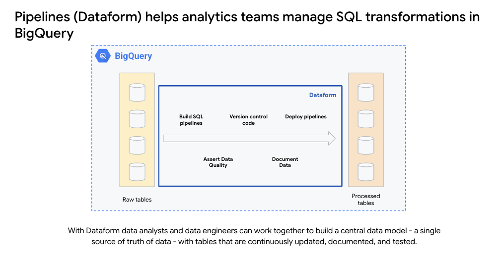

# BigQuery Pipelines (Dataform) Training Guide

This guide provides a concise overview of key Dataform concepts and features, empowering data teams to effectively develop, version control, and orchestrate SQL workflows in BigQuery. Each section includes a link to the Dataform documentation for in-depth learning. Also we have added a hands on lab to help you understand the concepts better which also included the use of LLM to generate the content directly in BigQuery via Dataform.

If you like to listen to an audio version instead of reading pleasse check out this Audio based version of the Training Guide:

https://github.com/user-attachments/assets/c1ea502a-ccee-40eb-9dd1-6d9703c523c0


We will be adding video content to this guide to help you understand the concepts better [coming soon].

## Video Content: 

### Dataform Introduction

[video coming soon] 

### Dataform repository and workspace

[video coming soon] 

### Dataform workflow development

[video coming soon] 

### Dataform workflow compilation and execution

[video coming soon] 

### Dataform data quality testing

[video coming soon] 

### Dataform environments and developer workflows

[video coming soon] 

## 1. Introduction to Dataform

Dataform is an open-source framework for managing and orchestrating SQL-based transformations in BigQuery. It simplifies the process of building, testing, and deploying data pipelines by providing a framework for managing SQL-based transformations.

**Key Features and Benefits:**

*   **Modular Data Transformations:** Organize and build complex data pipelines using modular and reusable SQL-based models.
*   **Version Control and Collaboration:** Integrate with Git for seamless version control, enabling collaboration and easy tracking of changes.
*   **Automated Code Validation:** Validates your SQL code and provides warnings if any issues are detected.
*   **Dependency Management:** Define dependencies between models and tasks, ensuring the correct execution order.
*   **Improved Data Pipeline Maintainability:** Simplifies the management and maintenance of data pipelines.



For a comprehensive overview of Dataform, refer to the Dataform documentation: [Dataform Overview](https://cloud.google.com/dataform/docs/overview)

## 2. Repositories and Workspaces

In Dataform, each project is stored in a repository, which houses configuration files, SQLX files, and JavaScript files. These repositories support version control and can be linked to a Git provider like GitHub or GitLab. Currently, the only available options for Git providers are GitHub and GitLab.

Dataform also allows you to create workspaces within a repository for development. Workspaces provide an environment to develop and test Dataform code before deploying it to production.

**Key Concepts:**

*   **Repository:** A collection of files that define your Dataform project.
*   **Workspace:** An isolated environment for developing and testing Dataform code.
*   **Version Control:** Using Git to track changes and manage file versions.

**About workflow_settings.yaml**

The workflow_settings.yaml file, introduced in Dataform core 3.0, stores Dataform workflow settings in the YAML format.
The following code sample shows a sample workflow_settings.yaml file:

```yaml
  defaultProject: my-gcp-project-id
  defaultDataset: dataform
  defaultLocation: australia-southeast2
  defaultAssertionDataset: dataform_assertions
```
In the preceding code sample, the key-value pairs are described as follows:

*   **defaultProject:** Your BigQuery Google Cloud project ID.
*   **defaultDataset:** The BigQuery dataset in which Dataform creates assets, called dataform by default.
*   **defaultLocation:** Your default BigQuery dataset region. For more information on BigQuery dataset locations, see Dataset locations In this location, Dataform processes your code and stores executed data. This processing region has to match the location of your BigQuery datasets, but does not need to match the Dataform repository region.
*   **defaultAssertionDataset:** The BigQuery dataset in which Dataform creates views with assertion results, called dataform_assertions by default.

Learn more about repositories and workspaces in the Dataform documentation: [Create Repository](https://cloud.google.com/dataform/docs/create-repository)

## 3. Workflow Development

Dataform provides a structured approach to developing data transformation workflows. You can define various actions within a workspace, including:

*   **Source data declarations:** Declare the source data for your transformations. This involves specifying the location and format of your raw data, allowing Dataform to access and utilize it in your workflows.

    ```sql
    config {
      type: "declaration",
      schema: "my_dataset",
      name: "my_table",
      database: "bigquery",
    }
    ```

*   **Tables and views:** Define tables and views using SQLX files. SQLX files extend SQL with Dataform-specific features, enabling you to define table schemas, transformations, and dependencies.

    ```sql
    config {
      type: "table",
      schema: "my_dataset",
      name: "my_transformed_table"
    }

    SELECT
      *
    FROM
      ${ref('my_table')}
    ```

*   **Incremental tables:** Create tables that are updated incrementally. This is useful for large datasets where only a subset of data changes frequently. Dataform efficiently updates these tables by processing only the changes, saving time and resources.

    ```sql
    config {
      type: "incremental",
      schema: "my_dataset",
      name: "my_incremental_table",
      uniqueKey: ["customer_id", "order_date"],
      partitionBy: {
        field: "order_date",
        data_type: "timestamp",
        granularity: "day"
      }
    }

    SELECT
      customer_id,
      order_date,
      -- ... other columns
    FROM
      ${ref('my_table')}
    WHERE
      ${incremental()}    -- this function automatically generates the incremental where clause
    ```

*   **Dependencies:** Specify dependencies between actions to ensure correct execution order. Dataform automatically manages these dependencies, ensuring that tasks are executed in the correct sequence.

    ```sql
    config {
      type: "table",
      schema: "my_dataset",
      name: "my_final_table",
      dependencies: [
        "my_transformed_table",
        "my_incremental_table"
      ]
    }

    SELECT
      *
    FROM
      ${ref('my_transformed_table')}
    JOIN
      ${ref('my_incremental_table')} USING (customer_id)
    ```

*   **Documentation:** Add documentation to tables and columns within your code. This documentation is integrated with BigQuery, making it easily accessible and searchable.

    ```sql
    config {
      type: "table",
      database: "your_project_id",
      schema: "ILS",
      name: "test_david_ILS_categories",
      description: "A table description here",
      columns: {
        category_id: {
          description: "Description of category_id",
          type: "STRING"
        },
        category_name: {
          description: "Description of category_name",
          type: "STRING"
        }
      }
    }
    ```

*   **Data quality tests:** Implement assertions to ensure data consistency. Assertions allow you to define rules and checks on your data, ensuring that it meets your quality standards.

    ```sql
    config {
      type: "table",
      name: "my_table",
      assertions: {
        uniqueKey: "my_column",
        notNull: "another_column"
      }
    }
    ```

Dataform uses Dataform core, an extension of SQL, to define these actions. Dataform core provides features like dependency management, automated data quality testing, and data documentation.

**Code Reuse with JavaScript**

Dataform allows you to use JavaScript for code reuse across files and repositories. You can create JavaScript files inside the `includes` folder to define variables and functions that can be accessed across multiple files within a Dataform repository.

To achieve code reuse across multiple Dataform repositories, you can leverage packages. Packages are collections of reusable code that can be created and imported into your Dataform projects.

It's important to highlight that the documentation created in Dataform is directly pushed to BigQuery. This seamless integration allows for easy access to documentation within BigQuery and facilitates the use of other BigQuery tools for data discovery and exploration.

For detailed information on javascript in Dataform, refer to the Dataform documentation: [Javascript in Dataform](https://cloud.google.com/dataform/docs/javascript-in-dataform)

## 4. Workflow Compilation and Execution

Dataform compiles the workflow code in your workspace in real-time, translating Dataform core into SQL queries. You can view the compiled queries and details of each action in the workspace.

Once the code is compiled, you can execute the workflow. Dataform executes the actions in the dependency tree, ensuring that tasks are executed in the correct order.

**Scheduling Options:**

Dataform offers various options for scheduling workflow executions:

*   Workflow configurations: Schedule executions directly within Dataform.
*   Workflows and Cloud Scheduler: Use Cloud Scheduler to trigger Dataform workflows.
*   Cloud Composer: Orchestrate Dataform workflows using Cloud Composer.

Learn more about workflow compilation and execution in the Dataform documentation: [Code Lifecycle](https://cloud.google.com/dataform/docs/code-lifecycle)

Learn more about scheduling options in the Dataform documentation: [Dataform Scheduling](https://cloud.google.com/dataform/docs/workflow-configurations)

## 5. Data Quality Testing

Dataform allows you to implement data quality tests, called assertions, to ensure the consistency and reliability of your data. You can define assertions within the `config` block of a SQLX file or in separate assertion files.

**Types of Assertions:**

| Assertion Type      | Description                                                                 |
| ------------------- | --------------------------------------------------------------------------- |
| uniqueKey           | This condition asserts that, in a specified column, no table rows have the same value. |
| nonNull             | This condition asserts that the specified columns are not null across all table rows. This condition is used for columns that can never be null. |
| rowConditions       | This condition asserts that all table rows follow the custom logic you define. |
| uniqueKeys          | This condition asserts that, in the specified columns, no table rows have the same value. |

**Example of Assertions:**

```sql
config {
  type: "incremental",
  assertions: {
    rowConditions: [
      'signup_date is null or signup_date > "2022-08-01"',
      'email like "%@%.%"'
    ]
  }
}
SELECT ...
```
**Custom Assertions**

Manual assertions are SQL queries that you write in a dedicated SQLX file. A manual assertion SQL query must return zero rows. 
If the query returns rows when executed, the assertion fails.

The following code sample shows a manual assertion in a SQLX file that asserts that fields A, B, and c are never NULL in sometable:

```sql
config { type: "assertion" }

SELECT
  *
FROM
  ${ref("sometable")}
WHERE
  a IS NULL
  OR b IS NULL
  OR c IS NULL
```

For more information on data quality testing in Dataform, refer to the Dataform documentation: [Dataform Assertions](https://cloud.google.com/dataform/docs/assertions)


## 6. Best practices for repository size

Repository size impacts multiple aspects of development in Dataform, such as:

*   Collaboration
*   Codebase readability
*   Development processes
*   Workflow compilation
*   Workflow execution

Dataform enforces API quotas and limits on compilation resources. Large repository size can cause your repository to exceed these quotas and limits. This can lead to failed compilation and execution of your SQL workflow.

To mitigate that risk, we recommend splitting large repositories. When you split a large repository, you divide a large SQL workflow into a number of smaller SQL workflows housed in different repositories and connected by cross-repository dependencies.

This approach lets you adhere to Dataform quotas and limits, fine-grain processes and permissions, and improve codebase readability and collaboration. However, managing split repositories can be more challenging than managing a single repository.

To learn more about the impact of repository size in Dataform and best practices for splitting repositories, see [Splitting repositories](https://cloud.google.com/dataform/docs/splitting-repositories).

## 7. Best practices for repository structure

We recommend structuring files in the `definitions` directory to reflect the stages of your workflow. Keep in mind that you can adopt a custom structure that best fits your needs.

The following recommended structure of `definitions` subdirectories reflects the key stages of most SQL workflows:

*   `sources`, storing data source declarations
*   `intermediate`, storing data transformation logic
*   `output`, storing definitions of output tables
*   Optional: `extras`, storing additional files

Names of all files in Dataform must conform to BigQuery table naming guidelines. We recommend that the names of files in the `definitions` directory in a Dataform repository reflect the subdirectory structure.

To learn more about best practices for structuring and naming files in a repository, see [Structuring code in a repository](https://cloud.google.com/dataform/docs/structure-repositories).

## 8. Best practices for code lifecycle

The default code lifecycle in Dataform consists of the following phases:

1.  **Development** of SQL workflow code in Dataform workspaces. You can develop with Dataform core or exclusively with JavaScript.
2.  **Compilation** of your code into a *compilation result* using settings from your *workflow settings file*. You can configure custom compilation results with release configurations and workspace compilation overrides.
    *   With *release configurations*, you can configure custom compilation results of your whole repository. You can later schedule their execution in *workflow configurations*.
    *   With *workspace compilation overrides*, you can configure compilation overrides for all workspaces in your repository, creating custom compilation results of each workspace.
3.  **Execution** of the compilation result in BigQuery. You can schedule executions or repository compilation results with *workflow configurations*.

To manage code lifecycle in Dataform, you can create execution environments, for example, development, staging, and production.

To learn more about code lifecycle in Dataform, see [Introduction to code lifecycle in Dataform](https://cloud.google.com/dataform/docs/code-lifecycle).

You can select to keep your execution environments in a single repository, or in multiple repositories.

## 9. Execution environments in a single repository

You can create isolated execution environments such as development, staging, and production in a single Dataform repository with *workspace compilation overrides* and *release configurations*.

You can create isolated execution environments the following ways:

*   Split development and production tables by schema
*   Split development and production tables by schema and Google Cloud project
*   Split development, staging, and production tables per Google Cloud project

Then, you can schedule executions in staging and production environments with *workflow configurations*. We recommend triggering executions manually in the development environment.

To learn more about best practices for managing code lifecycle in Dataform, see [Managing code lifecycle](https://cloud.google.com/dataform/docs/managing-code-lifecycle).

## 10. Resources

Dataform provides various resources to help users understand and utilize its features effectively. These resources include:

*   **Pricing:** Information on Dataform pricing and usage costs.
*   **Quotas and limits:** Details about the quotas and limits associated with Dataform usage.
*   **Locations:** Information on the available regions and locations for Dataform deployments.
*   **Support:** Access to support channels and resources for assistance with Dataform.

You can find these resources in the Dataform documentation: [Dataform Docs](https://cloud.google.com/dataform/docs)

## 11. Summary

Dataform offers a robust and efficient way to manage data transformation workflows in BigQuery. By leveraging its 
features such as modularity, version control, automated testing, and dependency management, data teams can improve the quality, maintainability, and reliability of their data pipelines. This guide has covered the essential aspects of Dataform, and the links to the Dataform documentation provide further details for those who want to explore specific topics in greater depth.
